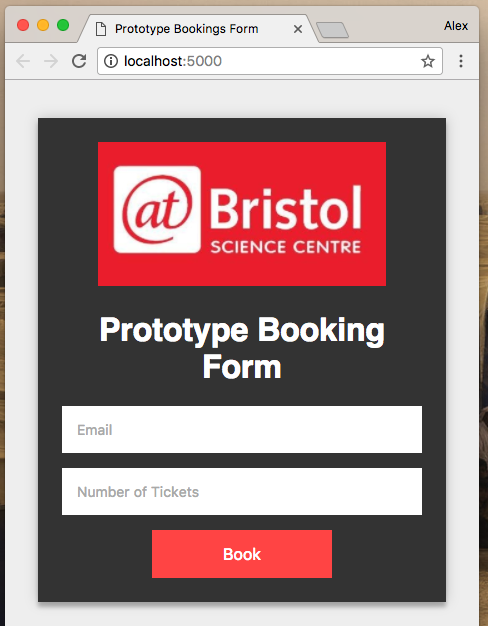

# SPE Booking
Mock interface for adding bookings. This app can be used as either a home booking or a booking done via a terminal outside of @bristol. Bookings done via the terminal also go into the recent bookings collection which allows them to be shown to the front desk worker.



## Documention
### Usage
```bash
$ git clone https://github.com/begly/spe-booking.git
$ cd spe-booking
$ npm install
$ npm start
```

Now open [http://localhost:5000](http://localhost:5000).

### Firebase interaction
Uses the [spe-bookings firebase project](https://console.firebase.google.com/project/spe-booking).

Writes bookings to booking collection and uses an event watcher to then add to the recent bookings collection. Bookings consists of documents of the form:
```
{
  "email": "example@example.com",
  "quantity": "2",
  "timestamp": 1481721844976
}
```

Recent bookings collection contains a list of IDs of recent bookings to be used by the front desk interface.
